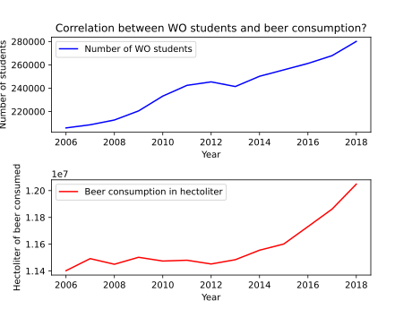

# CLS Seminars assignment 2

## Paper titles
MCC Van Dyke et al., 2019:\
Fantastic yeasts and where to find them: the hidden diversity of dimorphic fungal pathogens,\
The Rise of Coccidioides: Forces Against the Dust Devil Unleashed.\
JT Harvey, Applied Ergonomics, 2002:\
An analysis of the forces required to drag sheep over various surfaces.\
DW Ziegler et al., 2005:\
The neurocognitive effects of alcohol on adolescents and college students

## Data plot
\
The figure above shows the potential correlation between the number of enrolled WO students against the volume of beer that has been consumed in the past year. As the number of students grows the volume of consumed beer increases.
